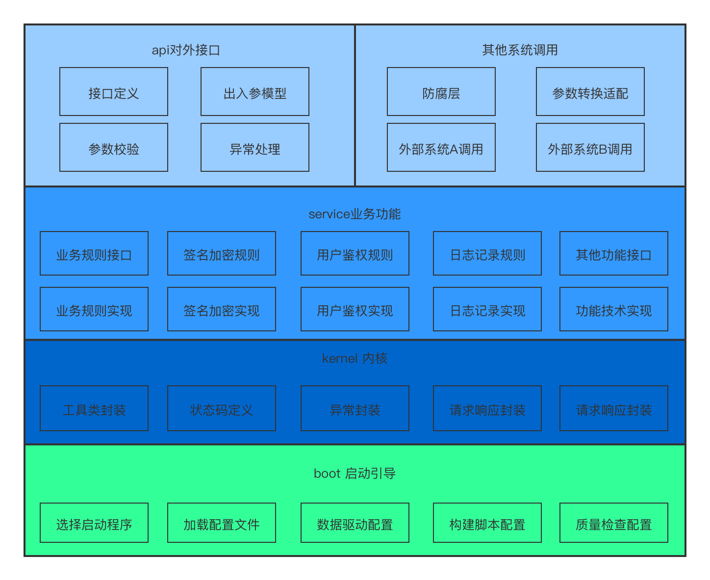

Start
======
A fast and flexible development framework

# Quick start
1.先把这个项目从 git服务器 上 clone 下来
```bash
git@github.com:lanshiqin/start.git
```

2.然后切换到项目所在的目录中
```bash
cd start
```

3.用 Gradle 命令生成一个 IDEA 工程
```bash
./gradlew idea
```

这个命令会生成一个.ipr 文件，这就是 IDEA 的工程文件，用 IDEA 打开即可。命令执行过程中会自动下载项目所需依赖
不使用IDEA直接clone打开并构建项目到原因时因为每个人到开发环境有所不同，为了避免出现我成功你失败的情况，
建议使用本地的Gradle构建程序，本项目使用 Gradle 6.4.1 构建，如果使用本地Gradle构建，可以执行如下操作
```bash
gradlew idea
```

4.构建应用
```bash
./gradlew build
```

5.启动应用
```bash
./gradlew bootRun
```

# Start Framework

系统模块

| 模块 | 描述 |
| -------- | -------------- |
| api  | 对外接口模块        |
| service  | 业务模块        |
| kernel  | 内核模块        |
| boot      | 启动引导模块      |

模块职责
* api接口模块：负责与客户端交互，定义接口和出入参。支持Kotlin应对快速变化的接口，建议采用一个Controller对应一份Module文件

* service业务模块：根据业务拆分，定义interface和对应的实现类，业务模块的每个方法需要拆封的足够细，建议单元覆盖率达到100%。

* kernel内核模块：为上层业务模块提供基础支持，工具封装，状态码定义，异常封装，请求响应封装，数据操作封装

* boot启动引导模块：加载配置，代码风格和单元覆盖率检查配置，引入SpringBoot作为启动程序，也可以根据需要修改成外部容器部署的启动方式。

* 系统架构图


# Automation

Start 采用自动化项目最佳实践

* 生成 IDE 工程；
* 编译；
* 打包；
* 运行测试；
* 代码风格检查；
* 测试覆盖率；
* 数据库迁移；
* 运行应用；

使用 CheckStyle进行代码风格检查
```bash
./gradlew check
```

使用 JaCoCo 进行测试覆盖率检查
```bash
./gradlew check
```

使用 Flyway 进行数据库迁移
```bash
./gradlew flywayMigrate
```